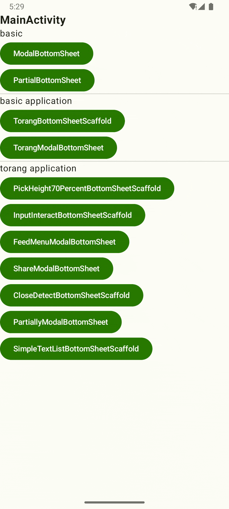

## BottomSheet란?

- 화면의 하단에 고정된 보조 컨텐츠(secondary content)를 표시할 때 사용
- standard와 modal 두가지 타입이 있음
- 보조적인 내용을 표시할 때 사용해야 함
- 메인 컨텐츠와 상호작용을 위해 사라질 수 있음

sheetState를 통해 sheet를 보이고 사라지게 할 수 있음.

## 공홈 예제 연습하기
ModalBottomSheetPractice.kt

### Interactive mode 사용시 주의
Preview의 Interactive mode에서 modal이 뜰 때 배경이 사라지는 오류가 발생
실제로 기기에서 동작 시킬때는 뒤에 배경이 나옴 (ModalBottomSheet의 배경에 내용을 넣는 파라미터가 있는지 한참 찾았음ㅠ)

# TorangBottomSheet 모듈

bottom sheet 기능을 구현하며 정리하기위해 만든 모듈

## ModalBottomSheet

- if문을 사용해서 모달의 visible을 설정

## PartialBottomSheet

- sheetState 생성 시, 옵션을 통해 바텀시트가 부분적으로 올라올지 전체 화면으로 올라올지 설정할 수 있는 옵션이 있음.

https://developer.android.com/develop/ui/compose/components/bottom-sheets

https://m3.material.io/components/bottom-sheets/overview

https://github.com/material-components/material-components-android/blob/master/docs/components/BottomSheet.md

