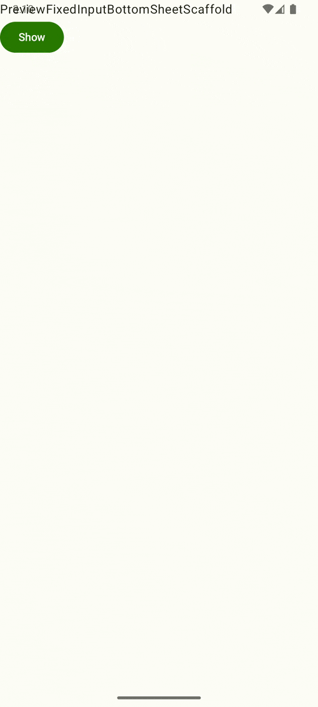
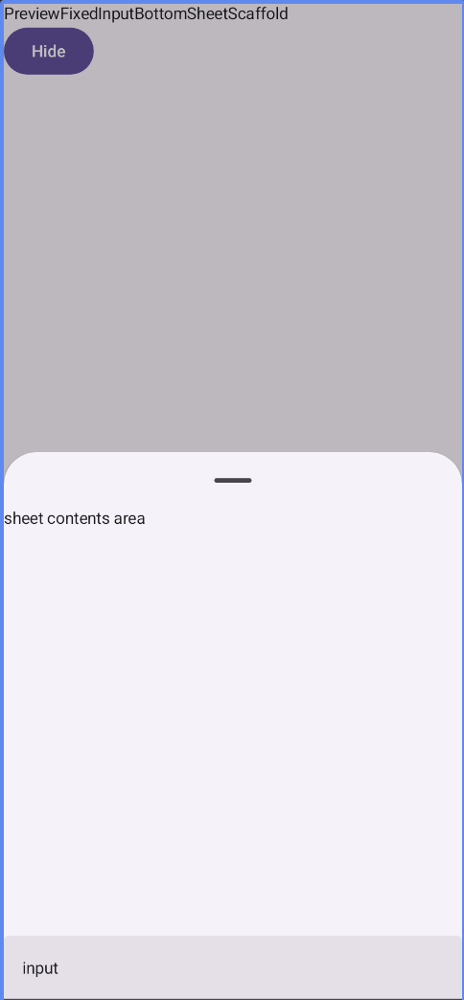

# [FixedInputBottomSheetScaffold](../library/src/main/java/com/sarang/torang/compose/bottomsheet/bottomsheetscaffold/FixedInputBottomSheetScaffold.kt)



ModalBottomSheet를 사용하려다 실패함.(모달 화면의 위에 추가적인 UI 레이어를 올릴 수 없었음.)
BottomSheetScaffold로 구현. (BottomSheet위에 다른 UI 레이어를 올릴 수 있음.)

## 하단에 고정 입력창 만들기

Box안에 BottomSheet와 input을 함께 배치



```kotlin
Box(modifier = modifier.imePadding()) { // edge to edge 에서 imePadding을 줘야 하단 영역이 적용됨
    TorangBottomSheetScaffold(
        // ...
    )
    if (show) // bottom sheet가 보이면 input 영역 보이기
        Box(Modifier.align(Alignment.BottomCenter)) {
            input()
        }
}
```

## 입력창을 스크롤에 따라 아래로 내리기 위해 offset 설정

```kotlin
Box(
    Modifier
        .align(Alignment.BottomCenter)
        .absoluteOffset(y = inputOffset)
) {
    input()
}
```

## 입력창이 Drag handler 영역에 닿았을 때 같이 아래로 내리기

bottom sheet를 스크롤하면 시트의 높이가 아닌 시트외 빈공간에 대한 높이를 알 수 있음.

- BottomSheet의 최대 높이 측정 ... a
- BottomSheet 제외한 빈공간 ... b
- a-b = bottom sheet의 높이 ... c

input창 높이라 50이라면

if(c < 50)
input창을 (input창 높이 - c) 만큼 내린다.

그런데 이렇게 하면 input창하고 bottom sheet가 같읕 높이 일 때 내려간다.

draghalder이라는 영역을 만들어 여기에 닿았을 때 내려가게 만들도록 했다.

if(c < 50 + draghalder 높이)
input창을 (input창 높이 + draghalder 높이 - c) 만큼 내린다.

```kotlin
val dragHandlerHeight = 50.dp // BottomSheet drag handle 높이 (임의로 잡음 50dp)
var maxBottomSheetHeight by remember { mutableStateOf(0.dp) } // bottom sheet의 최대 높이
var currentBottomSheetHeight by remember { mutableStateOf(0.dp) } // bottom sheet의 현재 높이
val criterionHeight = inputHeight + dragHandlerHeight // input 영역이 함께 내려가는 기준값 :  input높이 + draghadler 높이
val inputOffset =
    (criterionHeight - currentBottomSheetHeight).coerceAtLeast(0.dp) //  현재 bottom sheet 높이가 기준값 보다 작다면, inputOffset 값으로 input 창을 함께 내린다.
```

# 고려해야할 점

화면에 전체 높이에서 - bottom sheet의 빈 공간 만큼을 뺏는데<br>
<b>화면 전체 높이 != bottom sheet의 최대 높이</b> 가 달랐다.
그래서 bottom sheet가 최초에는 내려가 있어 이 높이를 구해 최대값으로 설정하는 로직을 추가했다.<br>
그래서 화면에 들어오자마자 expand 상태로 만들면 안된다. 

정확히 bottom sheet의 requireOffset 값이 화면에 어떤 영역을 반환 하는지
전체 화면 높이와 계산해서 위 기능을 적용하는 방법을 알아봐야 한다.